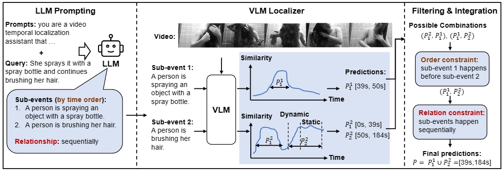

# Training-free Zero-Shot Video Temporal Grounding using Large-scale Pre-trained Models

In this work, we propose a training-free zero-shot video temporal grounding approach that leverages the ability of pre-trained large models. Our method achieves the best performance on zero-shot video temporal grounding on Charades-STA and ActivityNet Captions datasets without any training and demonstrates better generalization capabilities in cross-dataset and OOD settings.

Our paper was accepted by ECCV-2024.



## Quick Start

### Requiments
- pytorch
- torchvision
- tqdm
- salesforce-lavis
- sklearn
- json5
- openai

### Data Preparation

To reproduce the results in the paper, we provide the pre-extracted features of the VLM in [this link](https://pan.pku.edu.cn) and the outputs of the LLM in [`dataset/charades-sta/llm_outputs.json`](dataset/charades-sta/llm_outputs.json) and [`dataset/activitynet/llm_outputs.json`](dataset/activitynet/llm_outputs.json). Please download the pre-extracted features and configure the path for these features in [`data_configs.py`](data_configs.py) file.

## Main Results

### Standard Split

```bash
# Charades-STA dataset
python evaluate.py --dataset charades --llm_output dataset/charades-sta/llm_outputs.json

# ActivityNet dataset
python evaluate.py --dataset activitynet --llm_output dataset/activitynet/llm_outputs.json
```

| Dataset        | IoU=0.3 | IoU=0.5 | IoU=0.7 |  mIoU   |
| :-----         | :-----: | :-----: | :-----: | :-----: |
|  Charades-STA  |  67.04  |  49.97  |  24.32  |  44.51  |
|  ActivityNet   |  49.34  |  27.02  |  13.39  |  34.10  |


### OOD Splits

```bash
# Charades-STA OOD-1
python evaluate.py --dataset charades --split OOD-1

# Charades-STA OOD-2
python evaluate.py --dataset charades --split OOD-2

# ActivityNet OOD-1
python evaluate.py --dataset activitynet --split OOD-1

# ActivityNet OOD-2
python evaluate.py --dataset activitynet --split OOD-2
```

| Dataset              | IoU=0.3 | IoU=0.5 | IoU=0.7 |  mIoU   |
| :-----               | :-----: | :-----: | :-----: | :-----: |
|  Charades-STA OOD-1  |  66.05  |  45.91  |  20.78  |  43.05  |
|  Charades-STA OOD-2  |  65.75  |  43.79  |  19.95  |  42.62  |
|  ActivityNet OOD-1   |  43.87  |  20.41  |  11.25  |  31.72  |
|  ActivityNet OOD-2   |  40.97  |  18.54  |  10.03  |  30.33  |


```bash
# Charades-CD test-ood
python evaluate.py --dataset charades --split test-ood

# Charades-CG novel-composition
python evaluate.py --dataset charades --split novel-composition

# Charades-CG novel-word
python evaluate.py --dataset charades --split novel-word
```

| Dataset                           | IoU=0.3 | IoU=0.5 | IoU=0.7 |  mIoU   |
| :-----                            | :-----: | :-----: | :-----: | :-----: |
|  Charades-STA test-ood            |  65.07  |  49.24  |  23.05  |  44.01  |
|  Charades-STA novel-composition   |  61.53  |  43.84  |  18.68  |  40.19  |
|  Charades-STA novel-word          |  68.49  |  56.26  |  28.49  |  46.90  |
